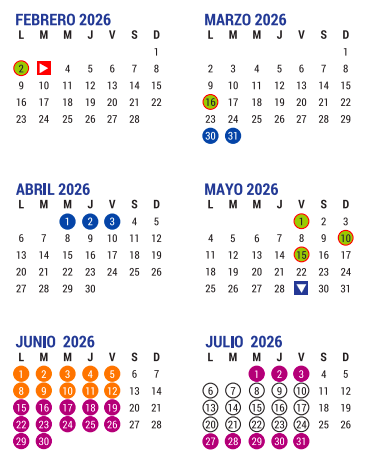

# Introducción a las Finanzas y a la empresa
## Semestre: 2026-2
### Del 2 de febrero al 10 de junio de 2026
### Licenciatura en Ciencia de Datos

## Horario

+ Martes y jueves 7:00 a 9:00 hrs.
+ Viernes de 8:00 a 9:00 hrs.

# Presentación

**Profesor:** Eduardo Selim Martínez Mayorga (eduardo.selim@ciencias.unam.mx)

**Adjunto:** Luis Enrique Villalón Pineda (lenriquev13@ciencias.unam.mx)

1. Introducción a las finanzas y a la empresa
1.1 La empresa y su organización
1.2 Las finanzas y la empresa
2. El área de operación o producción
2.1 Planeación y asignación de recursos
2.2 Optimización operativa y financiera
3. El área de ventas y marketing
3.1 Análisis del mercado
3.2 Planes y estrategias de mercadotecnia
3.3 Pronóstico de ventas
4. El área de finanzas y las Finanzas Corporativas
4.1 La asignación del capital y evaluación de las inversiones
4.2 La decisión de financiamiento y estructura de capital
4.3 La decisión y política de dividendos
4.4 Valuación de empresas
5. Los Mercados Financieros
5.1 El mercado de dinero
5.2 El mercado de capitales
5.3 El mercado cambiario
5.4 El mercado de derivados
5.5 Microestructura del mercado
5.6 Participantes, liquidez y función del mercado
5.7 Tipos de mercados, y protocolos de operaciones
5.8 Órdenes de mercado
5.9 Órdenes límite
5.10 Otras órdenes y opcionales

6. Las Inversiones
  6.1 El análisis bursátil
  6.2 Elaboración de portafolios de inversión
  6.3 La administración del riesgo financiero
  6.4 La ingeniería financiera
  6.5 Operaciones bursátiles (trading)
  6.6 Tipos de operaciones bursátiles
  6.7 Operaciones bursátiles electrónicas
  6.8 Operaciones bursátiles con algoritmos
  6.9 Operaciones bursátiles de acceso directo

## Bibliografía

1. Brun, X., & Moreno, M. (2008). Análisis y selección de inversiones en mercados financieros. Barcelona: Profit Editorial.
2. Castañeda González, F., & Aguirre Álvarez, J. (2000). Manual de finanzas corporativas (2a. ed.). Editorial de la Universidad de Santiago de Chile.
3. Damodaran, A. (2011). Applied Corporate Finance: A user's Manual. (3a ed.). United States of America: John Wiley & Sons, Inc.
4. Gitman, Lawrence J. y Michael Joehnk (2009). Fundamentos de inversiones, décima edición, trad. de Miguel Ángel Sánchez Carrión, México, Pearson Educación.
5. Graham, J., Smart, S. y Megginson, W. (2011). Finanzas corporativas: el vínculo entre la teoría y lo que las empresas hacen. (3a ed). EUA: Cengage.
6. Ross, S. A., Westerfield, R. W. y Jaffe, J. (2012). Corporate Finance. (9a ed.). EUA: McGraw Hill.
7. Ehrhardt, M. C. y Brigham, E. F. (2017). Finanzas Corporativas. EUA: Cengage.

# 🎖 EVALUACIÓN 🎖
El curso será evaluado de la siguiente manera:

+ Dos exámenes parciales: De manera individual en el salón de clases, cuyo valor es del 60\% de la calificación final.
+ Un examen final: De manera individual en el salón de clases, cuyo valor es del 20\% de la calificación final
+ Proyecto final: En equipos de a lo más 3 personas, cuyo valor es del 20\%
+ Es necesaria asistencia de al menos el 85\% para poder presentar las evaluaciones.
+ La escala de calificaciones en la siguiente:
[0,6)-5, [6, 6.6)-6, [6.6, 7.6)-7, [7.6, 8,6)-8, [8.6, 9.6)-9 y [9.6, 10)-10
+ No se cambia ninguna calificación por NP. No hay renuncias a calificaciones.

# ACLARACIONES

+ Las sesiones requieren asistencia plena, no sólo física.
+ Bajo ningún motivo se aceptarán tareas después de la fecha fijada de entrega.
+ No se realizarán exámenes extemporáneos por ningún motivo.
+ No se permiten teléfonos móviles encendidos y en consecuencia, queda prohibido salir del salón para contestar llamadas. En caso de hacerlo se retirará lo que resta de dicha sesión.
+ No se permite la entrada después de la hora más 15 minutos

# FORMA DE ENTREGA DE LAS TAREAS:
+ Se debe respetar el orden de las preguntas, y si no se contesta alguna, se debe escribir la pregunta y especificar que no se contestó. En caso de no ser así, no se revisará dicha tarea, obteniendo la calificación de cero en dicha tarea.
+ Limpieza y letra legible. Preferentemente en LaTeX o RMarkdown

# CALENDARIO

## Exámenes Parciales
+ Parcial 1 (30\%). Profesor titular. Martes 24 de marzo de 2026.
+ Parcial 2 (30\%): Profesor adjunto (Teoría de Portafolios). Jueves 28 de mayo de 2026.
+ Examen final (20\%): Martes 26 de mayo de 2026.
